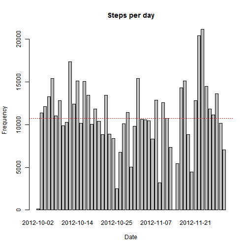
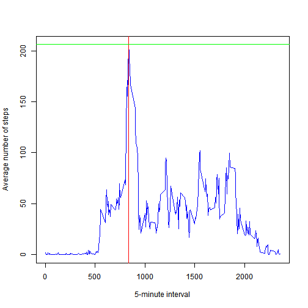
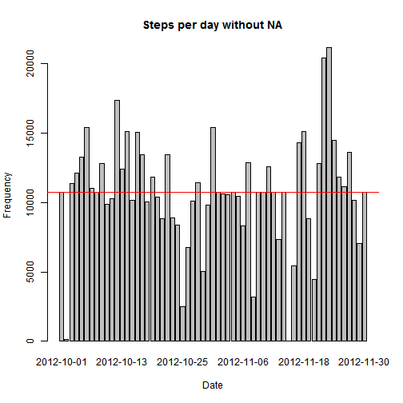

##Summary of the assignment

This assignment makes use of data from a personal activity monitoring device, such as Fitbit, Nike Fuelband, or Jawbone Up, which collects data at 5 minute intervals throughout the day. The data consists of two months of data from an anonymous individual collected during the months of October and November 2012, and include the number of steps taken in 5 minute intervals each day.

The variables included in this dataset are:

- steps: Number of steps taking in a 5-minute interval (missing values are coded as NA)
- date: The date on which the measurement was taken in YYYY-MM-DD format
- interval: Identifier for the 5-minute interval in which measurement was taken

The dataset is stored in a CSV file and there are a total of 17,568 observations in this dataset.


The **goal** of this assignment is to write a report that answers the following questions:

1. Loading and preprocessing the data
2. What is mean total number of steps taken per day?
3. What is the average daily activity pattern?
4. Imputing missing values
5. Are there differences in activity patterns between weekdays and weekends?


##1. Loading and preprocessing the data

First, the CSV file that contains 17,568 observations will be loaded by using *read.csv()*.


```r
activity_data <- read.csv("activity.csv", head = TRUE, sep = ",")
```

Before I continue with the assignment, I want to find out more about the contents of the CSV file. 

First I will display the internal structure of the activity_data object by using *str()*.


```r
str(activity_data)
```

```
## 'data.frame':	17568 obs. of  3 variables:
##  $ steps   : int  NA NA NA NA NA NA NA NA NA NA ...
##  $ date    : Factor w/ 61 levels "2012-10-01","2012-10-02",..: 1 1 1 1 1 1 1 1 1 1 ...
##  $ interval: int  0 5 10 15 20 25 30 35 40 45 ...
```

What I can see from the structure displayed above, is that data belonging to the *steps* column are class integer (note that I could also check this by calling *class(activity_data$steps)*). I also know that there will be some missing values (NA) in this dataset. 


```r
class(activity_data$steps)
```

```
## [1] "integer"
```

I can also see that dates are class factor and written in the following format: YYYY-MM-DD.

Interval holds integers starting from 0 to 2355 for each day and holds no NA values. Now, these 5-minute intervals can be interpreted as hour:minute of each day. For example, 0 could mean midnight, 1000 could mean 10 AM (10:00), 2015 can mean 20:15 (or 8:15 PM), with the last 5-minute interval being 23:55 (11:55 PM). Since 0-2355 repeats for each day, I will interpret my results accordingly.

Now that I know how my data looks like, I can continue with the assignment.

##What is mean total number of steps taken per day?

For this part of the assignment, I will first calculate the total number of steps taken per day by using *aggregate()* and ignore the missing values (NA) in the dataset by using *na.omit()*.


```r
 steps_per_day <- na.omit(aggregate(activity_data$steps, list(date = activity_data$date), FUN = sum))
```

Once I run the code, I can see how many steps a person has made each day. Below you can see a total number of steps (*x*) for the first five days: 


```r
 head(steps_per_day, 5)
```

```
##         date     x
## 2 2012-10-02   126
## 3 2012-10-03 11352
## 4 2012-10-04 12116
## 5 2012-10-05 13294
## 6 2012-10-06 15420
```

Since for the 2012-10-01 we had a not available (NA) number of steps for all intervals, the whole day is skipped from the calculation. I cannot assume that a person made 0 steps, so I will not assign 0 to day 1 (2012-10-01). The following day (2012-10-02), the person made 117 steps in the interval 2210 and 9 steps in the interval 2215 (based on the information in the *activity_data*), which sums up to (in total) **126** steps taken on the day 2012-10-02.


Then I will make a histogram of the total number of steps taken each day and find mean and meadian of the number of steps taken daily. To calculate the mean and median, I will need the following 2 R functions:

- *mean()*
- *median()*


```r
barplot(steps_per_day$x, 
        main="Steps per day", 
        names.arg = steps_per_day$date,
        xlab="Date",
        ylab = "Frequency")

mean_step <- mean(steps_per_day$x)
median_step <- median(steps_per_day$x)

# I will call mean_step and median_step to print out the values for mean and median
mean_step
```

```
## [1] 10766.19
```

```r
median_step
```

```
## [1] 10765
```

```r
# since the difference between mean and median is not large, green horizontal dotted line representing median is so close to the red dotten line representing mean that it can barely be seen on the plot
abline(h=median_step,col="green",lty=3)
abline(h=mean_step,col="red",lty=3)
```

 


Mean is **10766.19** and median is **10765**, which indicates that we are deadling with a right skewed, non-symmetric, distribution (mean is larger than median). In praxis, this is often the case (many distributions that occur in praxis are skewed, not symmetric). 

##What is the average daily activity pattern?

To make a time series plot of the 5-minute interval (x-axis) and the average number of steps taken, averaged across all days (y-axis) I will use *plot()* type "l". But first I have to find the average number of steps per a five-minute interval. To do this, I will use *aggregate()*.


```r
pattern <- aggregate(list(steps = activity_data$steps), list(interval = activity_data$interval),
          FUN = mean, na.rm=TRUE)
```

Object *pattern* consists of two columns:

- interval: lists 5-minute intervals

- steps: average number of steps averaged across all days


Let's check the average number of steps taken in the first five intervals:

```r
head(pattern,5)
```

```
##   interval     steps
## 1        0 1.7169811
## 2        5 0.3396226
## 3       10 0.1320755
## 4       15 0.1509434
## 5       20 0.0754717
```

Which 5-minute interval, on average across all the days in the dataset, contains the maximum number of steps?

From the plot, I can see that this must be an interval between 500 and 1000 (or 5:00 and 10:00 AM) and that the maximum number of steps taken must be a number larger than 200. Let's find the exact number of max steps and the exact interval. 


```r
which_interval <- pattern[pattern$steps == max(pattern$steps), ]
which_interval
```

```
##     interval    steps
## 104      835 206.1698
```

**Answer:** maximum average number of steps taken is 206.1698, in the interval 835 (8:35 AM). Since the data is measured during the whole week (5 weekdays, 2 weekend days), we can conclude that the reason why a person takes a maximum number of steps at 8:35 AM is because this person probably walks to work. If our person works 8 hours a day, then it is to be assumed that he/she goes back home at around 17 h (works from 9-17 h). Since in this interval we don't have as many steps as in the morning, we could assume that our person either takes some public transport to go back home, regularly walks a short distance before meeting a colleague for a drink or regularly visits a supermarket on the way back home. After 20:00 h (interval 2000), there is a visible decrease in the number of steps (which indicates that the person is most likely relaxing at home). Also, in the interval 0-500 (midnight to 5 AM) there are hardly any steps taken, i.e. person must be sleeping. So far, the plot and the data represented on it make sense and depict a usual behavioral pattern of a person that has a job (or regular education during the week from 9-17). 

Let´s also add a green line representing the maximum number of steps on average taken for all days and a red line representing the interval when the maximum number of steps on average was taken.


```r
plot(pattern,  
  type = "l",
  xlab = "5-minute interval", 
  ylab = "Average number of steps",
  col = "blue")
abline(v = which_interval$interval, col = "red", lty = 1)
abline(h = which_interval$steps, col = "green", lty = 1)
```

 

The plot above indicates that the average number of steps increases in the interval [5:00-10:00] and then decreases starting at approx. interval [18:00-23:55].  

##Imputing missing values

Now I will calculate and report the total number of missing values in the dataset (number of rows with NA):


```r
sum(is.na(activity_data))
```

```
## [1] 2304
```

To keep the original csv file unchanged, I will duplicate the original file and save it under name activity_copy.csv.


```r
file.copy("activity.csv", "activity_copy.csv")
```

```
## [1] FALSE
```

```r
activity_data_copy <- read.csv("activity_copy.csv", head = TRUE, sep = ",")
```

To find a mean for each 5-minute interval, I will used *tapply()*.


```r
mean_per_interval <-tapply(activity_data$steps, activity_data$interval, mean, na.rm=TRUE)
```

If I want to check the mean for, let's say, first two intervals (interval at the 0th minute and 5th minute), I will call *mean_per_interval[c(1,2)]*.


```r
mean_per_interval[c(1,2)]
```

```
##         0         5 
## 1.7169811 0.3396226
```

Now that I have mean values for all intervals, I have to replace the NA values in my dataset with the obtained means.
First I will find out how many intervals each day consists of:


```r
sum(activity_data$date == "2012-10-01")
```

```
## [1] 288
```

The answer is 288. This makes sense. A short explanation: 288 intervals * 5 minutes = 1440 minutes a day. 1440 / 60 = 24 hours (1 day).
I will replace the NA values with the obtained means by checking where in my dataset NA values are. When NA is found, write a mean value for that specific interval in place of NA.


```r
for (i in which(is.na(activity_data_copy)))
{
  activity_data_copy[i,1] <- mean_per_interval[((i-1)%%288)+1]
}
```

I will save the new values into the copy of the original activity.csv file that I have created earlier (activity_copy.csv).


```r
write.csv(activity_data_copy, file="activity_copy.csv")
```

Now I can finally find the number of steps taken per day, once the NA values have been replaced by mean values. This information will be stored in *steps_per_day1* (nothing fancy with naming, I just added 1 after steps_per_day).


```r
steps_per_day1 <- aggregate(activity_data_copy$steps, list(date = activity_data_copy$date), FUN = sum)

# sum of steps once the NA values have been removed
sum(activity_data_copy$steps)
```

```
## [1] 656737.5
```

```r
# sum of steps prior NA removal
sum(activity_data$steps, na.rm=TRUE)
```

```
## [1] 570608
```

The results above indicate that once we removed the NA values, it appears as if a person has taken in total more steps (656737.5 > 570608). 

I can also plot the number of steps.


```r
barplot(steps_per_day1$x, 
        main="Steps per day without NA", 
        names.arg = steps_per_day1$date,
        xlab="Date",
        ylab = "Frequency")

# Calculate mean and median steps
mean_steps1 <- mean(steps_per_day1$x)
median_steps1 <- median(steps_per_day1$x)

# What is the mean?
mean_steps1
```

```
## [1] 10766.19
```

```r
# What is the median?
median_steps1
```

```
## [1] 10766.19
```

```r
# since mean and median are the same, I will plot just one of the two (I chose to plot mean)
abline(h=mean_steps1, col="red", lty=1)
```

 


As seen above, now mean and median are the same (both 10766.19), meaning that the data is evenly divided around the mean. As I replaced the NA values by means for each interval, this outcome was to be expected.

##Are there differences in activity patterns between weekdays and weekends?

To find whether there are any differences in activity patterns between weekdays and weekends, I have to extract weekdays by using *weekdays()* function. Since dates in my dataset are class *factor*, I have to first transform the data into POSIXt. First, I will set locale to English. Then I will transform factor to POSIXt. Once transformed, I will update my data.frame's column "date" with POSIXt data. The results obtained after calling the *weekdays()* function are saved to a character vector called *days*. Then I will add the names of the weekdays into my data.frame by creating an additional column called "days".


```r
Sys.setlocale("LC_TIME", "English")
```

```
## [1] "English_United States.1252"
```

```r
new_dates <- strptime(activity_data_copy$date, "%Y-%m-%d")
activity_data_copy$date <- new_dates
days <- weekdays(activity_data_copy$date)
activity_data_copy[, "days"] <- days
```

Now I will add another column into the data.frame called "weekday_weekend" and write in "weekday"" if a value in the "days" column corresponds to Monday, Tuesday, Wednesday, Thursday or Friday, and "weekend" if the days are Saturday or Sunday. To do this, I will use a *for* loop which goes through the whole data.frame.


```r
for(i in (1:nrow(activity_data_copy))){
  
  if(activity_data_copy$days[i] %in% c("Monday", "Tuesday", "Wednesday", "Thursday", "Friday"))
    {activity_data_copy[i,"weekday_weekend"]  <- "weekday"}
    
  else if(activity_data_copy$days[i] %in% c("Saturday", "Sunday"))
    {activity_data_copy[i, "weekday_weekend"]  <- "weekend"}
    
  else
   print("there was some mistake")
}
```

Finally, to save my results into the csv file, I will write the results into the copy of the original file (activity_copy.csv).


```r
write.csv(activity_data_copy, file = "activity_copy.csv")
```

The final task is to make a panel plot containing a time series plot (i.e. type = "l") of the 5-minute interval (x-axis) and the average number of steps taken, averaged across all weekday days or weekend days (y-axis). 

First, let's find the average number of steps taken on weekdays and weekends, and let's also prepare a dataset "average_steps" so that it contains three columns, namely "weekend_weekday", "interval", and "avg_steps".


```r
average_steps <- aggregate(activity_data_copy$steps, by = list(activity_data_copy$weekday_weekend, activity_data_copy$interval), FUN = mean, na.rm = TRUE)

names(average_steps)[1] <- "weekday_weekend"
names(average_steps)[2] <- "interval"
names(average_steps)[3] <- "avg_steps"
```

Once the dataset is ready, we can plot the average number of steps taken on weekends and weekdays by using *xyplot()* with a 5-minute interval on the x-axis and average number of steps on the y-axis. 


```r
library(lattice)
xyplot( avg_steps ~ interval | weekday_weekend, 
        data = average_steps, 
        type="l", 
        layout=c(1,2), 
        main = "Number of steps on weekends and weekdays",
        xlab="Interval", 
        ylab="Number of steps")
```

 

Based on the graph above, it appears that the person likes to sleep longer/has a more relaxing morning on the weekends than at the weekdays (notice the number of steps taken in the interval 0-500, or midnight to 5 AM). What we can also see is that the person makes the most steps on weekdays between 8 and 9 AM (probably walks to the office) and after 20:00 the number of steps decreases, i.e. the person is relaxing at home. In general, there are more steps taken during the day on Saturday and Sunday as compared to the number of steps taken during the weekday at the same period of time. One possible explanation is that the person sits in the office during the weekdays, while being more active in terms of walking during the weekend. 


```r
# number of average steps taken on weekends
steps_weekend <- na.omit(subset(average_steps, weekday_weekend == "weekend"))
sum_weekend <- sum(steps_weekend$avg_steps)

# how many steps in total per weekend
sum_weekend
```

```
## [1] 12201.52
```

```r
# number of average steps taken on weekdays
steps_weekday <- na.omit(subset(average_steps, weekday_weekend == "weekday"))
sum_weekday <- sum(steps_weekday$avg_steps)

# how many steps in total per weekday
sum_weekday
```

```
## [1] 10255.85
```

From the calculation above, we can also conclude that the person takes on average more steps during the weekend than during the workdays. Based on the information found at http://walking.about.com/od/measure/a/averagesteps.htm, men take an average of 7192 steps per day, while women take an average of 5210 steps per day. Since our test person takes on average 11228 steps per day [(12201.52 + 10255.85)/2], we can conclude that this person has quite an active lifestyle.
